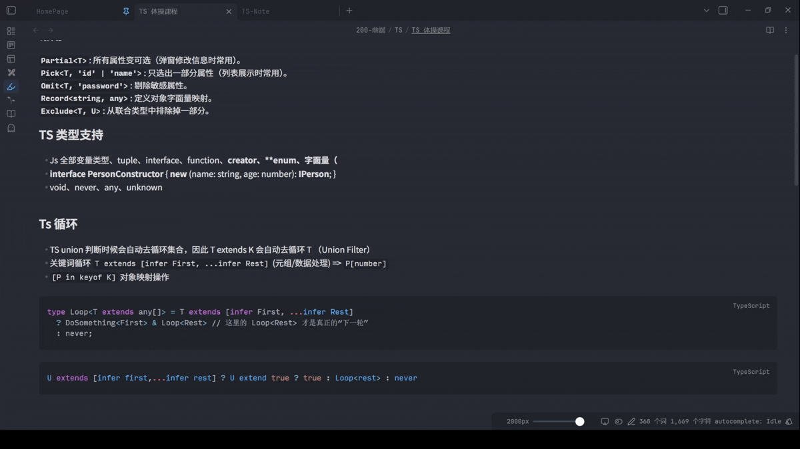

# Remember column width

An Obsidian plugin that remembers a custom **editor line width per file**, so each note can have the reading width that fits it best.

> A status bar slider lets you change the current file's width in real time. Each file's width is saved automatically and restored the next time you open it.

---

## Usage

### Status bar slider

Open any markdown file. A horizontal slider appears at the **far left of the status bar**, with the current width in pixels next to it. Drag to change. The slider's right end automatically tracks the current panel's available width so you never have any "dead travel" past the visible edge.

Click the **number** (e.g. `900px`) to open a small dialog for entering an exact value.

### Settings

Open **Settings → Community plugins → Remember column width**.

| Setting | Purpose |
|---|---|
| **Default width (px)** | Used when a file has no saved width yet |
| **Minimum width (px)** | Lower bound for the slider and inputs |
| **Maximum width (px)** | Upper bound for the slider and inputs |
| **Clear all saved widths** | Removes every per-file override |
| **Customized files** | List of files with overrides; edit the number to change, or **Reset default** to remove |

### Commands

Open the command palette (`Ctrl/Cmd + P`):

- **Remember column width: Set width for this file…**
- **Remember column width: Reset width for this file**

---

## Installation

### Via BRAT (for beta testers)

1. Install the [BRAT](https://github.com/TfTHacker/obsidian42-brat) plugin.
2. Run **BRAT: Add a beta plugin for testing** and paste this repo URL.
3. Enable **Remember column width** under Community plugins.

### Manual

1. Download `main.js`, `manifest.json`, and `styles.css` from the [latest release](../../releases/latest).
2. Copy them into `<your-vault>/.obsidian/plugins/remember-column-width/`.
3. Reload Obsidian and enable the plugin under **Settings → Community plugins**.

---

## Data and privacy

- The plugin stores per-file widths in `<your-vault>/.obsidian/plugins/<plugin-id>/data.json`. Nothing else is read or written.
- No network requests are made. No telemetry. No third-party services.
- The plugin temporarily overrides one Obsidian setting (`readableLineLength`) while enabled. The original value is snapshotted on first run and restored when the plugin is disabled or uninstalled.

---

## Compatibility

- Obsidian `1.4.0` or later
- Desktop only (`isDesktopOnly: true`)

---

## License

[MIT](LICENSE)
